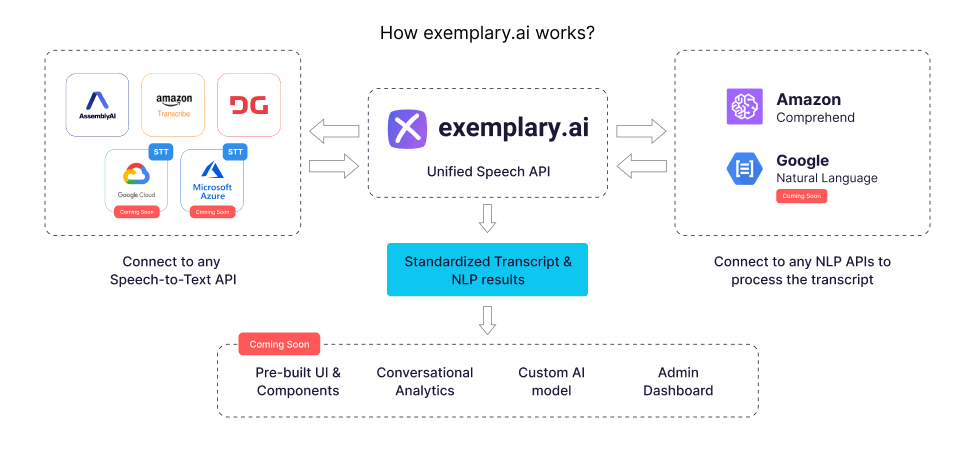

<p align="center">
  <a href="https://docs.exemplary.ai/?utm_source=github"></a> 
</p>
<p align="center">
<b>Unified API for Multi-Provider ASR/Speech To Text and NLP</b>
</p>
<p align="center"> Access all Speech-To-Text and NLP providers using this vendor-agnostic open API. Apply ASR, NLP and NLU tasks from a large catalog of providers.
</p>

<h4 align="center">
  <b><a href="https://docs.exemplary.ai/playground">Try live demo</a></b>
  •
  <a href="https://docs.exemplary.ai/?utm_source=github">Documentation</a>
  •
    <a href="#roadmap">Roadmap</a>
  •
  <a href="https://discord.gg/8hyZqYmsZR">Discord Community</a>
  </h4>

<p align="center">

</p>

> :information_source: **Release Schedule**: We're set to release our code by Oct 1st, 2022 under the [Apache License 2.0](LICENSE). For early access, email us at [hello@exemplary.ai](mailto:hello@exemplary.ai)

At exemplary.ai, we're on a mission to help developers build Conversational AI apps faster, leverage advances in language technology, with the help of our API & Toolkit.

- **Multi Provider flexibility**. Quickly and easily compare, switch between, and try out different STT and NLP providers.
- **No vendor lock-in** Our provider agnostic format for transcript and transcript metadata storage allows you to build without worrying about provider specific workflows and implementation details.
- **Use the best technology for the job** Whether mitigating downtime, or benchmarking accuracy, with this API, leveraging the strengths of different providers is now easy. Try out new models and keep up to date on new features from different providers.
- **Effortless ML pipelines for anyone** Pipeline ASR and NLP tasks by simply stating the tasks you want, and the API will stitch them together while abstracting away provider specific job handling and callback mechanisms.
- **Standardized transcript formats** An open, standardized format, with adapters built for each provider, keeps this API maintainable and extensible. Easily add new Providers and functionality that integrates nicely with the rest of the API and pipelines.
- **Build faster** *(coming soon)* With pre-built UI and components, you can create the app faster.
- **Extensible and Open** Help contribute and build open adapters, and use our flexible API format to stay at the cutting edge.

## Quick Start

While we're  working on getting the cloud version of this product ready, you can get started with your own deployment by following the instructions below.

#### Prerequisites
To run the deployment, you need an [AWS account](http://console.aws.amazon.com) with appropriate permissions, and [Serverless Framework](https://www.serverless.com/framework/docs/getting-started) installed locally with your credentials set up.

Run:
```bash
git clone https://github.com/exemplaryai/ai-engine.git
cd ./ai-engine
yarn install
```
#### Set up providers
In `serverless.yaml`, set the following values under environment:
- For Deepgram - `DEEPGRAM_API_KEY`
    Get it here [here](https://developers.deepgram.com/documentation/getting-started/authentication/#create-an-api-key)
- For AssemblyAI - `ASSEMBLYAI_API_KEY`
    Get it from your AssemblyAI Console, after you've created an account, from under the Developers tab [here](https://app.assemblyai.com)
- For AI21 - `AI21_API_KEY`
    Get it from [your account page](https://studio.ai21.com/account/account), after you've created an account.
Your AWS account you are deploying to will be used for AWS Comprehend & Transcribe jobs.

Now that you've set up your provider keys, run:
```bash
yarn run-deploy
```

To run it locally on your dev environment, run:
```bash
yarn start
```

Alternatively, get started instantly with our [exemplary.ai cloud offering](https://docs.exemplary.ai/signup) **_(Coming Soon)_**

#### Usage
```bash
curl --location --request POST 'http://localhost:4000/v1/transcript' \
--header 'Authorization: Bearer <Your-Token>' \
--header 'Content-Type: application/json' \
--data-raw '{
         "url": "https://bw8pqua-9mxfd7.s3.amazonaws.com/m/snl-zoom-call.mp4",
         "provider": "deepgram",
         "speaker_labels": true,
         "summarize": false,
         "punctuate": true,
         "language": "en-US",
         "questions": "aws.comprehend",
         "sentiment": "google.cnl",
         "entities": "aws.comprehend"
}'
```

This requests creates a transcription job on a wav file, using `Deepgram` to obtain a transcript, along with speaker labels, punctuation, and with the language set to `en-US` (or a supported BCP 47 language code). Questions and Entities will be extracted using AWS Comprehend, while Sentiment will be extracted using Google Cloud Natural Language. You can read more about [language codes](https://docs.exemplary.ai/api-reference#language-codes), and additional options we expose to you for transcript creation at the [API Reference, here](https://docs.exemplary.ai/api-reference#create-a-new-transcription-job). Feel free to switch around the supported providers, and let the API abstract away the provider specific details.

Query your created transcripts and their status:
```bash
curl --location --request GET 'http://localhost:4000/v1/transcript' \
--header 'Authorization: Bearer <Your-Token>'
```

#### API Reference
Check out our [API Reference here.](https://docs.exemplary.ai/#quick-start)

## Features
- A standardized, provider-agnostic response format to store transcripts and NLP results for all providers
- Supports major audio file formats
- Supports Offline Transcriptions (Realtime support coming soon)
- Easy provider setup - add your STT & NLP providers by adding API their API keys
- NLP tasks we support: Sentiment, Questions, Summary, Action Items, Filler Word Detection, Entity Detection and Follow Ups
- ASR/Speech to Text & NLP Providers supported: AssemblyAI, Deepgram, Amazon Transcribe & Amazon Comprehend.

We frequently add new providers! 
**Coming soon**: Microsoft Azure, Google Cloud STT & Google Natural Language AI

## Demo
Use our [API playground](https://docs.exemplary.ai/playground) to visually build an api call. Use your choice of providers and couple them with NLP & NLU tasks.
<p align="center">

</p>

## Roadmap

**Short term (next 6 months)**

- **Admin Dashboard:** Manage your transcripts and view logs, provider settings, metrics, and monitor job statuses from a central dashboard.
- **Pre-built Transcript Viewer:** Interfaces that help you present your transcripts, along with detected speakers, an audio player and ready components to highlight NLP results.
- **Add new providers (STT & NLP):** Microsoft Azure, Google Cloud STT, IBM Watson STT, RevAI & Google Natural Language AI
- **AI Benchmark Tool:** Compare and benchmark ASR & NLP task performance between providers
- **Support for speech Engines:**  Nvidia Riva, Deepspeech and Kaldi
- Real-time Streaming ASR
- Video processing pipelines for transcripts

**Long term (next 18 months)**

- Create connectors for Vision, Text to Speech & Translation

## 🎙 Our Support

Issues are inevitable. When you have one, our entire team is around to help

- 💬 Reach us and the community on [Discord](https://discord.gg/rBTTVJp)
- 📄 Find a solution in our [Documentation](https://docs.exemplary.ai)
- ⚠️ Open an issue right here on [GitHub](https://github.com/exemplaryai/ai-engine/issues/new/choose)


## Contribute

We ❤️ contributors! If you'd like to contribute anything from a bug-fix to a feature update, start here

- 📖 Create an issue on [Github](https://github.com/exemplaryai/ai-engine/issues/new/choose)
- 📕 Create a Pull Request on [Github](https://github.com/exemplaryai/ai-engine/pulls)

## License

This repo is under the [Apache License 2.0](LICENSE).
